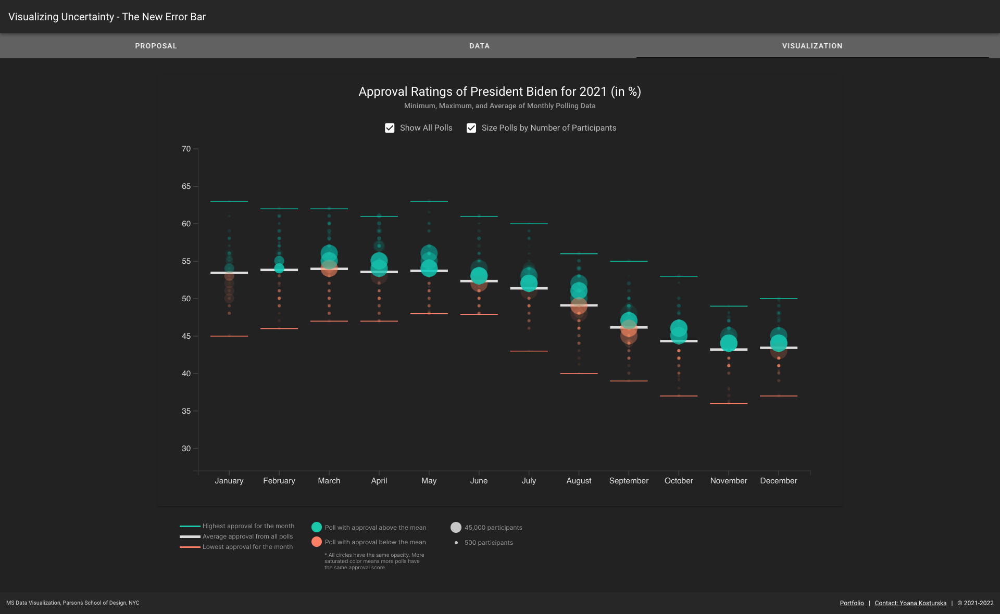

# Visualizing Uncertainty in Polling Data

#### Technologies used:
**Data Visualization**: d3.js, underscore.js, JavaScript 
**Front-end**: Vue, Vuetify 
**Data Cleaning and Processing**: Python, Pandas, Numpy, Matplotlib 
 
#### Project Links:
**Live Project**: [Visualizing Uncertainty in Polling Data](https://yoanacodes.github.io/projects/error_bars/)  
**Portfolio link with description**: [Visualizing Uncertainty in Polling Data](https://yoanacodes.com/#/projects/error_bars) 

#### About:
This project proposes a novel way to visualize uncertainty, specifically in polling data. Uncertainty in polling data is often represented by statistical concepts such as margin of error, standard deviation or confidence intervals, which are not easily understood by people with little to no background in statistics. This project suggest using intuitive measures and language, such as minimum, maximum, and average, to make uncertainty data available to everyone.
 

#### App Screenshot:

